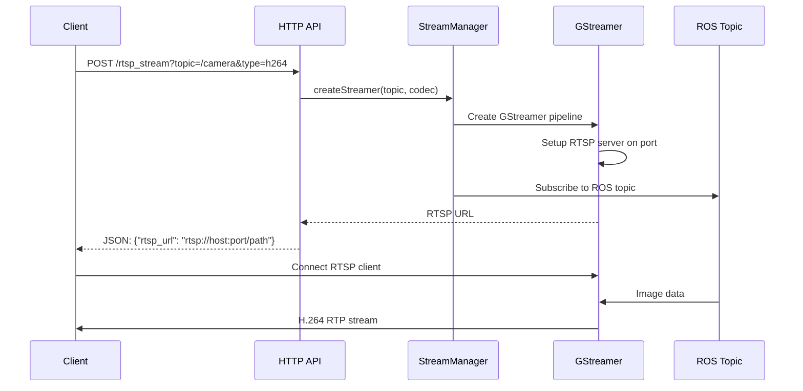

# RTSP Streaming Documentation

## Overview
The web_video_server provides GStreamer-based RTSP streaming functionality with dynamic ROS topic discovery integration. The RTSP streaming works seamlessly with the ROS 2 ecosystem, automatically discovering available camera topics and creating on-demand H.264/VP8/VP9 video streams.

## Key Features
- **Dynamic Topic Discovery**: Automatically discovers ROS camera topics via `sensor_msgs/Image` and `sensor_msgs/CompressedImage`
- **On-Demand Stream Creation**: RTSP streams created only when requested
- **Multiple Codec Support**: H.264, VP8, VP9 encoding via GStreamer
- **JSON API Integration**: RESTful HTTP API for stream management
- **Automatic Cleanup**: Inactive streams are automatically cleaned up

## Changes Made

### 1. Updated HTTP API for RTSP Stream Creation
**OLD:** `curl "http://localhost:8080/rtsp_stream?topic=/image_raw&codec=h264"`
**NEW:** `curl "http://localhost:8080/rtsp_stream?topic=/image_raw&type=h264"`

### 2. Updated RTSP URL Format
**OLD:** `rtsp://localhost:8554//image_raw`
**NEW:** `rtsp://localhost:8554/stream?topic=/image_raw&type=h264`

### 3. Stream Type to Codec Mapping
The system now maps HTTP stream types to appropriate RTSP codecs:
- `type=h264` → `codec=libx264`
- `type=vp8` → `codec=libvpx`
- `type=vp9` → `codec=libvpx-vp9`
- Other types → `codec=libx264` (default)

### 4. Improved RTSP Protocol Support
- Added proper OPTIONS method handling
- Added proper CSeq header handling in all RTSP responses
- Fixed RTSP method signatures to include request context

## Usage

### Starting the Server
```bash
# Start with both HTTP and RTSP enabled
ros2 run web_video_server web_video_server --ros-args -p http_enabled:=true -p rtsp_enabled:=true

# Or start with only RTSP
ros2 run web_video_server web_video_server --ros-args -p http_enabled:=false -p rtsp_enabled:=true
```

### Creating RTSP Streams
```bash
# Create H.264 stream
curl "http://localhost:8080/rtsp_stream?topic=/image_raw&type=h264"

# Create VP8 stream
curl "http://localhost:8080/rtsp_stream?topic=/image_raw&type=vp8"

# Create VP9 stream
curl "http://localhost:8080/rtsp_stream?topic=/image_raw&type=vp9"
```

### Using with GStreamer
```bash
# Basic H.264 streaming
gst-launch-1.0 rtspsrc location="rtsp://localhost:8554/stream?topic=/image_raw&type=h264" ! rtph264depay ! h264parse ! avdec_h264 ! videoconvert ! autovideosink

# Auto-detection
gst-launch-1.0 rtspsrc location="rtsp://localhost:8554/stream?topic=/image_raw&type=h264" ! decodebin ! videoconvert ! autovideosink

# Save to file
gst-launch-1.0 rtspsrc location="rtsp://localhost:8554/stream?topic=/image_raw&type=h264" ! rtph264depay ! h264parse ! mp4mux ! filesink location=output.mp4

# Stream over network
gst-launch-1.0 rtspsrc location="rtsp://localhost:8554/stream?topic=/image_raw&type=h264" ! rtph264depay ! h264parse ! rtph264pay ! udpsink host=192.168.1.100 port=5000
```

## Comparison with HTTP Streaming

### HTTP Streaming
- URL: `http://localhost:8080/stream?topic=/image_raw&type=mjpeg`
- Direct browser access
- MJPEG, PNG, H.264, VP8, VP9 support
- Real-time streaming

### RTSP Streaming
- URL: `rtsp://localhost:8554/stream?topic=/image_raw&type=h264`
- Requires RTSP client (GStreamer, VLC, etc.)
- H.264, VP8, VP9 support (transcoded from ROS topics)
- Real-time streaming with RTP protocol

## Testing

### Test with USB Camera
```bash
# Terminal 1: Start USB camera
ros2 run usb_cam usb_cam_node_exe --ros-args -p video_device:="/dev/video0"

# Terminal 2: Start web_video_server
ros2 run web_video_server web_video_server --ros-args -p http_enabled:=true -p rtsp_enabled:=true

# Terminal 3: Create RTSP stream
curl "http://localhost:8080/rtsp_stream?topic=/image_raw&type=h264"

# Terminal 4: View stream
gst-launch-1.0 rtspsrc location="rtsp://localhost:8554/stream?topic=/image_raw&type=h264" ! decodebin ! videoconvert ! autovideosink
```

### Test with VLC
```bash
vlc rtsp://localhost:8554/stream?topic=/image_raw&type=h264
```

## Current Limitations

1. **RTSP Protocol Implementation**: The current implementation has a simplified RTSP protocol that may not work with all RTSP clients. GStreamer connection gets stuck during the "Retrieving server options" phase.

2. **RTP Packetization**: The RTP packets are simplified and may not follow the complete RTP specification.

3. **SDP Description**: The SDP description is basic and may need enhancements for full compatibility.

## Future Improvements

1. **Complete RTSP Protocol Support**: Implement full RTSP 1.0 specification
2. **Proper RTP Packetization**: Implement RFC-compliant RTP packet structure
3. **Multiple Stream Support**: Support multiple concurrent streams on different ports
4. **Authentication**: Add RTSP authentication support
5. **Stream Discovery**: Automatic stream discovery for available topics

## Integration with Dynamic Discovery Systems

### ROS Topic Manager Integration
The RTSP streaming works seamlessly with dynamic topic discovery systems:

```bash
# 1. ROS system discovers available camera topics
ros2 topic list | grep -E "(image|camera)"

# 2. Client applications query available topics via RosTopicManager
# 3. RTSP streams created on-demand for selected topics
curl "http://localhost:8080/rtsp_stream?topic=/discovered_camera_topic&type=h264"

# 4. JSON response provides actual RTSP URL
{"rtsp_url": "rtsp://localhost:8554/_discovered_camera_topic"}
```

### Android Client Integration
For Android applications (like ATAK plugins), use the following pattern:

```java
// 1. Create RTSP stream via HTTP POST
String httpUrl = "http://" + host + ":8080/rtsp_stream?topic=" + topic + "&type=h264";
Request request = new Request.Builder().url(httpUrl).build();

// 2. Parse JSON response to get RTSP URL
JSONObject response = new JSONObject(responseBody);
String rtspUrl = response.getString("rtsp_url");

// 3. Connect to RTSP stream
cameraStreamManager.playRTSPStreamWithFallback(videoView, rtspUrl, "");
```

## Architecture

The RTSP streaming functionality uses GStreamer and is built on top of the existing HTTP streaming architecture:

### Core Components
1. **GstRTSPStreamerManager**: Manages multiple GStreamer RTSP streams
2. **GstRTSPStreamer**: Individual GStreamer pipeline for each topic
3. **HTTP Endpoint**: `/rtsp_stream` endpoint for creating streams via REST API
4. **GStreamer Pipeline**: `appsrc → videoconvert → x264enc → rtph264pay → RTSP`
5. **RTSP Server**: GStreamer's native RTSP server implementation

### Stream Lifecycle


### URL Format and Topic Sanitization
- **Input topic**: `/arena_camera/image_raw`
- **Sanitized path**: `_arena_camera_image_raw` (replaces `/` with `_`)
- **RTSP URL**: `rtsp://localhost:8554/_arena_camera_image_raw`

This design ensures consistency with the existing HTTP streaming while providing the benefits of RTSP protocol for real-time video streaming with full GStreamer integration.
